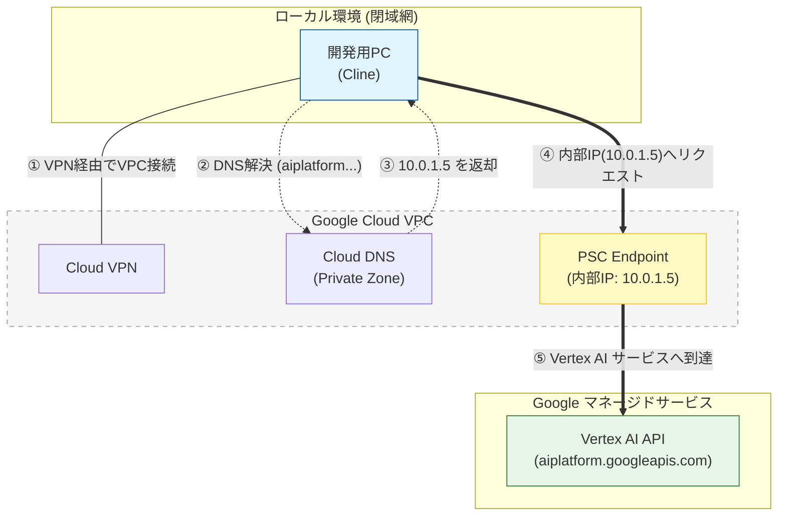

# Q1 インフラ・環境構築について

`インターネットから分離された（閉域網）環境で、Cursor/AntigravityのようなAIエージェント駆動開発を導入したいと考えています。※まだ提案の前段階なのですが..
当初はOllamaなどを用いた『ローカルLLM』環境を検討しましたが、実用的な精度を出すにはマシンスペックの要求が非常に高く、ハードルが高いと感じています。
そこで代替案として、GCP (Vertex AI) や AWS (Bedrock) などを閉域網接続で利用するエンタープライズ構成を検討していますが、これはセキュリティ要件の厳しい実務環境として現実的な選択肢となり得るでしょうか？また、この構成を採用する際、最大の障壁となるのはどの部分でしょうか。`

CursorやAntigravityはそれぞれインターネットからアクセスするエンドポイントにリクエストを送信するので、これらの利用は難しいと思います。

セキュリティ要件の厳しい環境の場合、Google CloudやAWSを利用することは十分選択肢となりえます。
障壁としては、利用できるツールはかなり限られることと、閉域網環境にVPN接続が許容されるのかどうかだと思います。

以下、Google CloudでVPNが利用できる前提で書きます。

ご提案としてVSCodeなどで利用できる[Cline](https://cline.bot/)という拡張機能が使えるかもしれません。Clineは過去に利用していたことがありますが、Betterな選択肢だとは思います。

ClineはVertex AIをAI Providerとして指定できるので、Vertex AIへの経路さえ確保できればプロキシサーバーの構築も不要になります。

ご自分のPCをCloud VPNを設定したVPC ネットワークに接続した環境を想定します。

これでGoogle Cloud のVPCネットワーク内にトラフィックの始点を設定できましたが、問題はVertex AIのエンドポイントです。

ClineはVertex AIをAI Providerとして利用する時に、通常では`aiplatform.googleapis.com`などのインターネットに公開されているドメインを利用します。

何もしなければ、PCはこのドメインを「インターネット上のグローバルIP」として名前解決してしまい、インターネットに出ようとし、閉域環境ならブロックされます。

ここで登場するのが、[Private Service Connect](https://docs.cloud.google.com/vertex-ai/docs/general/psc-interfaces?hl=ja)(PSC)という機能です。

この機能は、VPCネットワーク内に内部IPアドレスのうちの1つをGoogleへのエンドポイントとして割り当てることで、閉域網からGoogleのマネージドサービスにアクセスするための経路を用意するサービスです。

例えば次のように設定します。 ※このコマンドの妥当性を検証しているわけではない点ご了承ください。

エンドポイントのための内部IPアドレスを1つ確保します。

```
gcloud compute addresses create vertex-ai-psc-ip \
  --global \
  --purpose=PRIVATE_SERVICE_CONNECT \
  --addresses=10.0.1.5 \
  --network=YOUR_VPC_NAME
```

続いて転送ルールを作成します。

```
gcloud compute forwarding-rules create vertex-ai-forwarding-rule \
  --global \
  --network=YOUR_VPC_NAME \
  --address=vertex-ai-psc-ip \
  --target-google-apis-bundle=all-apis
```

これで残る問題は、`aiplatform.googleapis.com` などとアクセスしようとしても、その名前解決先が`10.0.1.5`であることをVPCネットワークがまだ知らないことです。

そこで最後に、プライベートCloud DNSを設定します。

```
gcloud dns managed-zones create googleapis-private-zone \
  --description="Private zone for Google APIs" \
  --dns-name="googleapis.com." \
  --networks=YOUR_VPC_NAME \
  --visibility=private

# 2. Aレコードの追加 (aiplatform.googleapis.com を 10.0.1.5 に向ける)
gcloud dns record-sets transaction start --zone=googleapis-private-zone

gcloud dns record-sets transaction add 10.0.1.5 \
  --name="aiplatform.googleapis.com." \
  --ttl=300 \
  --type=A \
  --zone=googleapis-private-zone

gcloud dns record-sets transaction execute --zone=googleapis-private-zone
```

リージョンを指定する場合ドメインは異なりますので、以下のドキュメントを参考にしてください。

https://docs.cloud.google.com/vertex-ai/docs/reference/rest#service:-aiplatform.googleapis.com

## 構成イメージ



# Q2 ガバナンス・制御に関する質問

`AIエージェントを実務適用する際の『ルールの強制力』について懸念があります。
例えば、『禁止コマンドを実行させない』『スタック防止のためにタスクを細分化する』『コード修正時にドキュメントも同期させる』といったルールをドキュメントに記載したとしても、AIがそれを参照・順守し続ける保証がありません。
単なるプロンプト指示（自然言語）だけでは制御しきれないこれらの課題に対して、システム的またはプロセス的に、どのように確実な強制力（ガードレール）を持たせるのがベストプラクティスとして考えられますでしょうか？　※個人開発ではGeminiAPIを利用したPRレビューのGithubActionの利用や、参照していけば必ずたどり着けるようなドキュメント構成を意識しているのですが、うまく行かないことも多々あります。。`

自然言語だけで制御しきることが難しいのは同感です。

まず、簡単に設定できそうな「禁止コマンドを実行させない」点に触れます。

大きく2種類の対策が考えられます。

## 1. サンドボックス環境で実行する

Cursorや他のツールで利用できるオプションですが、ネットワークやファイルシステムへのアクセスを制限した環境でAIエージェントを実行することが可能です。

許可したいコマンドは明示的に許可リストに設定することも可能です。

## 2. Allowlist, Denylistを活用する

ほとんどのAIエージェントには、許可または拒否されるコマンドを明示的に指定できます。

このrepositoryのClaude Codeでも、利用できるコマンドは許可リスト形式で記述しています。

https://github.com/YukiTominaga/ai-development-workflow/blob/fe9bb2fd9592a29308eaa1ccb8a4d362256eef6b/.github/workflows/claude.yaml#L32-L34

---

次に、「スタック防止のためにタスクを細分化する」についてです。

個人の感覚ですが、これを自然言語で制御するのは難しいので、私はPlanフェーズとActフェーズの2段階のアプローチを明示的に指定できるツールを利用するようにしています。

これは、CursorのPlanモードやKiroのSpec作成モードがタスクを分解するという作業に大いに貢献しています。

CursorのPlanモードが登場する以前はKiroのSpecモードで作成した内容をCursorのcontextに与える、ということをやっていました。

KiroのSpec作成モードはタスクを細分化し、細分化されたタスク単位でエージェントを実行できるので、ちょっとデモをしてみます。

---

「コード修正時にドキュメントも同期させる」については、思いつきで書かせてください。

AGENT.mdなどに自然言語でその指示を出すことは効果的ではないという感覚は一致します。

ご提案として、コードを書くエージェントでPRを作成したら、PRが作成されたことをトリガーに動作する「ドキュメントを修正する」ことだけを考えた別のエージェントを実行するのが良さそうです。

これにより、ルールを守らせるのではなく、勝手に同期される状態になるため、プロンプトの書き方に悩まされずに済むかもしれません。
